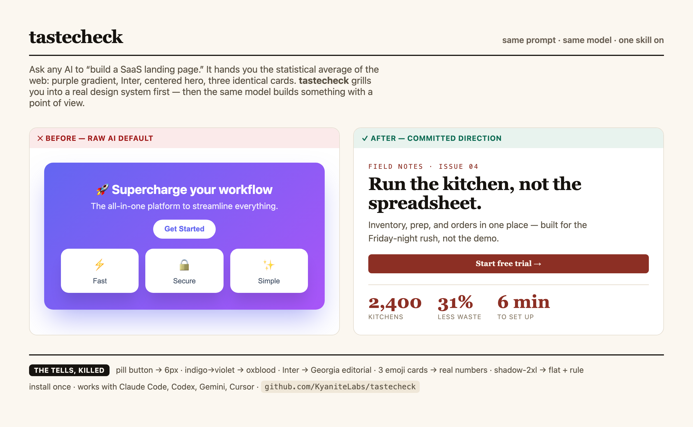

# tastecheck

**Every AI builds the same website.** Purple gradient, Inter font, centered hero, three
identical feature cards. You've seen it a thousand times because the model isn't
designing — it's returning the statistical average of the web.

**tastecheck is the fix.** It's a set of skills for AI coding agents that does two things
no prompt does: it **grills you into a real design system *before* it writes any code**,
then applies eleven checkable craft skills so the output has a point of view instead of
a purple gradient.



[](LICENSE)
[](#whats-inside)
[](#works-with-any-agent)
[](docs/VERIFICATION.md)

```bash
git clone https://github.com/KyaniteLabs/tastecheck
./tastecheck/install.sh
# then just build. Next time you say "make me a landing page," your agent
# stops and runs a taste check first.
```

---

## Why every AI site looks the same

In 2025 the creator of Tailwind publicly apologized for making `bg-indigo-500` the demo
default years ago — it trained a generation of tutorials, then a generation of models,
to reach for purple. Ask any LLM to "build a landing page" with no direction and it fills
every blank with the most probable token: purple gradient, Inter, centered hero, three
cards, pill buttons, glassmorphism. None of it is *wrong*. All of it is *average*.

You can't fix average with more polish. You fix it by **removing the blanks** — making
the real design decisions before the model gets to guess.

## The idea nobody else ships: a taste check *before* the build

Most "make AI design better" tools clean up after the fact. tastecheck's headline skill,
**design-system-interview**, does the opposite — it interrogates you first:

> *"'Modern' is a non-answer — name one site you'd be happy to resemble."*
> *"Pick a side: warm or cool? Don't say both — the middle is where generic lives."*
> *"One dominant color. Not five pastels. Not indigo→violet."*

Six or seven forcing questions, each leading with an opinion you can react to. If you
genuinely don't care, it **decides boldly and tells you** — never resolves to the safe
average. The output is a committed `DESIGN-SYSTEM.md` + design tokens that every other
skill builds from. Taste is the only moat against AI slop; this operationalizes it.

## What's inside

**The headline**
- **design-system-interview** — grills you into a committed design system before building; emits tokens the rest consume.

**Remove the tells**
- **deslop-ui** — the named AI giveaways (purple gradient, pill CTAs, Inter, 3-card hero, glassmorphism, emoji headers) and the exact fix for each.

**Get the foundations right**
- **web-typography** — type scale, measure, rhythm, fluid `clamp()`, web-font loading/CLS, WCAG text.
- **color-system** — OKLCH palettes that are cohesive *and* pass contrast.
- **dark-mode** — surfaces, elevation-by-lightness, desaturated accents, real toggle.

**Build the structure & behavior**
- **responsive-layout** — mobile-first, intrinsic Grid/Flex, container queries; survives any width.
- **component-states** — every interactive state (hover/focus-visible/active/disabled/loading/selected/error) + ARIA.
- **form-ux** — forms people finish: labels, validate-on-blur, specific errors, right input types.
- **empty-states** — the empty/loading/error screens everyone forgets.

**Polish & verify**
- **micro-motion** — animation that feels expensive: transform/opacity, 150–300ms, reduced-motion.
- **a11y-pass** — a runnable WCAG 2.2 AA fix pass.

Each skill is a folder: `SKILL.md` (decision order, non-negotiables, quick-start,
self-check) + `references/` (deep guidance + a `decision-records.md` explaining *why*) +
`assets/` (copy-paste starter CSS / generators / checklists).

## Not vibes — checkable, and actually tested

Every other "AI design" repo is itself AI slop: untested, hand-wavy, "make it pop." This
one is the opposite. Every rule is **checkable** (a value, a count, a yes/no), with
before/after and a self-check the agent runs on its own output:

- *Pill buttons:* `border-radius: 9999px` on a text CTA is a tell → 6–10px.
- *Dark mode:* never `#000`; base `#121212`, each elevation step **lighter**, not shadowed.
- *Color:* build ramps in **OKLCH** so contrast is predictable across hues.
- *Motion:* animate only `transform`/`opacity`; respect `prefers-reduced-motion`.

And we ate our own cooking: every skill was **rendered in a real Chromium browser** —
zero console errors across 17 views at mobile/tablet/desktop + dark mode — and reviewed
visually before release. The receipts are in [docs/VERIFICATION.md](docs/VERIFICATION.md)
and the rendered [demos/](demos/).

## Works with any agent

Skills are plain Markdown — no SDK, no runtime. tastecheck installs into **Claude Code,
Codex, Gemini CLI, Cursor, Kilocode, and Kimi** (anything that reads a `skills/`
directory), and you can point any other agent at a `SKILL.md` directly. Stop installing
Claude-only skill packs.

## How it all fits together

> **design-system-interview** (decide taste) → **color-system · web-typography ·
> dark-mode** (foundations) → **responsive-layout** (structure) → **component-states ·
> form-ux · empty-states** (behavior) → **micro-motion** (polish) → **a11y-pass**
> (verify) — with **deslop-ui** auditing the result against *your committed spec*, not
> the average.

## Install

```bash
git clone https://github.com/KyaniteLabs/tastecheck
./tastecheck/install.sh        # symlinks skills into every agent it detects
```

The skills then **auto-trigger** when your request matches ("make a landing page", "fix
this dark mode", "the headings wrap badly"). In Claude Code you also get slash commands:
`/designsystem`, `/deslop`, `/typography`, `/colorsystem`, `/darkmode`, `/responsive`,
`/states`, `/formux`, `/emptystates`, `/motion`, `/a11y`.

## License

MIT © Kyanite Labs. Use them, fork them, ship with them.

These skills distill widely-taught, public craft principles (typography, color science,
WCAG, web-platform best practices) in original form — not a copy of any individual's
work. Where an idea has a known origin it's credited in that skill's `decision-records.md`.
