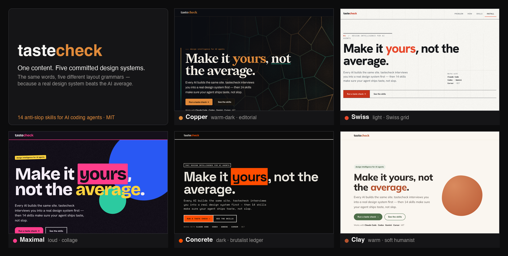

# TasteCheck

**Every AI builds the same website.** Purple gradient, Inter font, centered hero, three
identical feature cards, pill buttons, glassmorphism. You've seen it a thousand times
because the model isn't designing — it's returning the statistical average of the web.

**tastecheck is the fix.** It's a set of **15 craft skills for AI coding agents** that does
two things no prompt does: it **grills you into a real design system *before* it writes any
code**, then applies fifteen checkable craft skills so the output has a point of view
instead of a purple gradient.



*Five **real browser renders** — the same product story and core IA pushed through
five committed design systems. That's the whole pitch: a committed design system beats the AI
average. Open the [live gallery →](https://kyanitelabs.github.io/tastecheck/samples/)*

[](LICENSE)
[](#whats-inside)
[](#portable-markdown)
[](docs/VERIFICATION.md)

```bash
git clone https://github.com/KyaniteLabs/tastecheck
./tastecheck/install.sh
# then point your agent at ~/.agents/skills or its detected skills directory
```

**Live:** the [five-design-system gallery](https://kyanitelabs.github.io/tastecheck/samples/) ·
the [landing page](https://kyanitelabs.github.io/tastecheck/) ·
the [15-skill integration demo](https://kyanitelabs.github.io/tastecheck/demos/skill-integration.html)

---

## What is tastecheck?

tastecheck is a free, open-source (MIT) **pack of 15 frontend craft skills for AI coding
agents** — Claude Code, Codex, Gemini CLI, Cursor, Kilocode, Kimi. The headline skills
either *interview you into a committed design system before any code is written* or audit
an existing website to infer the intended system before changes. The rest apply checkable
rules for typography, color, theming, layout, component states, forms, motion,
accessibility, and removing AI "slop" tells. The result: a new build or partial existing
site gets a point of view, not the generic average.

## Why every AI site looks the same

In 2025 the creator of Tailwind publicly apologized for making `bg-indigo-500` the demo
default years ago — it trained a generation of tutorials, then a generation of models,
to reach for purple. Ask any LLM to "build a landing page" with no direction and it fills
every blank with the most probable token: purple gradient, Inter, centered hero, three
cards, pill buttons, glassmorphism. None of it is *wrong*. All of it is *average*.

You can't fix average with more polish. You fix it by **removing the blanks** — making
the real design decisions before the model gets to guess.

## The idea nobody else ships: a taste check *before* the build

Most "make AI design better" tools clean up after the fact. tastecheck's headline skill,
**design-system-interview**, does the opposite — it interrogates you first:

> *"'Modern' is a non-answer — name one site you'd be happy to resemble."*
> *"Pick a side: warm or cool? Don't say both — the middle is where generic lives."*
> *"One dominant color. Not five pastels. Not indigo→violet."*

Six or seven forcing questions, each leading with an opinion you can react to. If you
genuinely don't care, it **decides boldly and tells you** — never resolves to the safe
average. The output is a committed `DESIGN-SYSTEM.md` + design tokens that every other
skill builds from. Taste is the only moat against AI slop; this operationalizes it.

## Proof: five design systems, one product story

The strongest evidence the interview works: take the **same product story and core IA** and
run it through five different committed systems. You don't get five recolors — you get five
different visual/rhythm treatments on the same pitch. The repo includes a repeatable
verification gate for local links, install paths, command targets, CSS parse traps,
starter accessibility, and chart data-table parity.

- **[▶ Open the live gallery](https://kyanitelabs.github.io/tastecheck/samples/)** · source in [`samples/`](samples/)
- **[▶ Open the 15-skill integration demo](https://kyanitelabs.github.io/tastecheck/demos/skill-integration.html)** · source in [`demos/skill-integration.html`](demos/skill-integration.html)

| System | Territory | Signature structure | Type |
|---|---|---|---|
| [Copper](samples/copper/) | dark, warm, geological | irregular tessellated bento + structural basalt columns | Redaction + Archivo |
| [Swiss](samples/swiss/) | light, austere, exact | exposed 12-column subgrid the content sits on | Hanken Grotesk |
| [Maximal](samples/maximal/) | loud, kinetic | display word bleeding into a magenta block; sticker-wall collage | Bricolage Grotesque |
| [Concrete](samples/concrete/) | raw, mechanical, monochrome | ruled spec-sheet + dense ledger table; achromatic + one hazard accent | Space Grotesk + Space Mono |
| [Clay](samples/clay/) | warm, soft, humanist | alternating zig-zag soft-card flow with organic "pebble" shapes | Mulish |

Each was built through the same pipeline (interview → `DESIGN-SYSTEM.md` → skills → render →
audit) and reviewed by independent models from different families before shipping.

## What's inside

**The headline**
- **design-system-interview** — grills you into a committed design system before building; emits tokens the rest consume.
- **improve-existing-website** — audits a current site, infers the intended system, asks only the questions that change the fix, then makes the partial reality true.

**Remove the tells**
- **deslop-ui** — the named AI giveaways (purple gradient, pill CTAs, Inter, 3-card hero, glassmorphism, emoji headers) and the exact fix for each — visual *and* structural.
- **humanize-copy** — strip the ChatGPT accent from writing (the "delve / it's not just X, it's Y" tells) with a checkable kill-list.

**Get the foundations right**
- **web-typography** — type scale, measure, rhythm, fluid `clamp()`, web-font loading/CLS, WCAG text.
- **color-system** — OKLCH palettes that are cohesive *and* pass contrast.
- **theming** — light + dark + high-contrast from one token source; elevation by lightness, not shadow.

**Build the structure & behavior**
- **responsive-layout** — mobile-first, intrinsic Grid/Flex, container queries; survives any width.
- **component-states** — every interactive state (hover/focus-visible/active/disabled/loading/selected/error) + ARIA.
- **form-ux** — forms people finish: labels, validate-on-blur, specific errors, right input types.
- **empty-states** — the empty/loading/error screens everyone forgets.

**Polish & verify**
- **micro-motion** — animation that feels expensive: transform/opacity, 150–300ms, reduced-motion.
- **data-viz** — honest, Tufte-informed charts (data-ink, no chartjunk, lie-factor check) that also theme and pass a11y.
- **a11y-pass** — a runnable WCAG 2.2 AA fix pass with a paste-able auditor.
- **cognitive-a11y** — the layer WCAG barely touches: ADHD, autism, dyslexia and neurodivergent readability (plain language, structure, predictability).

Each skill is a folder: `SKILL.md` (decision order, non-negotiables, quick-start,
self-check) + `references/` (deep guidance + a `decision-records.md` explaining *why*) +
`assets/` (copy-paste starter CSS / generators / checklists).

## Not vibes — checkable, and actually tested

Every other "AI design" repo is itself AI slop: untested, hand-wavy, "make it pop." This
one is the opposite. Every rule is **checkable** (a value, a count, a yes/no), with
before/after and a self-check the agent runs on its own output:

- *Pill buttons:* `border-radius: 9999px` on a text CTA is a tell → 6–10px.
- *Dark mode:* never `#000`; base `#121212`, each elevation step **lighter**, not shadowed.
- *Color:* build ramps in **OKLCH** so contrast is predictable across hues.
- *Type:* every `clamp()` needs spaces around `+`/`−` or the browser silently drops it — verified by **measuring the rendered size**, not eyeballing.

And we ate our own cooking: the repo now ships a repeatable verification command instead
of a trust-me receipt. Run `npm test` for structural, installer, command, link, CSS,
a11y-starter, data-viz, and real-website integration checks. The integration page starts
from an existing kitchen SaaS HTML, audits the intended system, then exercises all 15
skills through real controls: themes, component states, form validation, empty/error/retry,
chart/table parity, copy, accessibility, cognitive readability, motion, and responsive
layout. Browser/manual QA remains documented separately in [docs/VERIFICATION.md](docs/VERIFICATION.md)
and the rendered [demos/](demos/).

## Portable Markdown

Skills are plain Markdown — no SDK, no runtime. The installer always links a canonical
`~/.agents/skills/` directory and also links detected homes for **Claude Code, Codex,
Gemini CLI, Cursor, Kilocode, and Kimi** when those directories already exist. Automatic
loading depends on each agent's skill support; otherwise point the agent at the relevant
`SKILL.md` directly. Claude Code also gets optional slash commands.

## How it all fits together

> **design-system-interview / improve-existing-website** (decide or infer taste) → **color-system · web-typography · theming**
> (foundations) → **responsive-layout** (structure) → **component-states · form-ux ·
> empty-states** (behavior) → **micro-motion · data-viz** (polish) → **a11y-pass ·
> cognitive-a11y** (verify) — with **deslop-ui** and **humanize-copy** auditing the result
> against *your committed spec*, not the average.

## Install

```bash
git clone https://github.com/KyaniteLabs/tastecheck
./tastecheck/install.sh        # symlinks skills into every agent it detects
```

The installer creates canonical links in `~/.agents/skills/` and mirrors them into detected
agent skill directories. In agents with skill auto-loading enabled, matching requests can
load the relevant skill; otherwise use the `SKILL.md` path directly. In Claude Code you
also get slash commands:
`/designsystem`, `/deslop`, `/humanize`, `/typography`, `/colorsystem`, `/theming`,
`/responsive`, `/states`, `/formux`, `/emptystates`, `/motion`, `/dataviz`, `/a11y`,
`/cognitive`, `/improvesite`.

## FAQ

**What is tastecheck?**
A free, open-source (MIT) pack of 15 craft skills for AI coding agents. It interviews you
into a committed design system before any code, or audits an existing site to infer the
system already trying to exist, then applies checkable rules for typography, color,
accessibility and removing AI "slop" tells — so output has a point of view instead of the
generic average.

**Why do AI-generated websites all look the same?**
With no design direction a model fills every blank with the most probable token: a purple/
indigo gradient, Inter, a centered hero, three identical cards, pill buttons, glassmorphism.
It's returning the average of the web, not designing. tastecheck removes the blanks first.

**Which AI coding agents does it work with?**
Any agent that can read plain Markdown skill files can use it. The installer links a
canonical `~/.agents/skills/` directory and mirrors into detected Claude Code, Codex,
Gemini CLI, Cursor, Kilocode, and Kimi skill dirs. Auto-loading depends on the agent.

**How is it different from other AI design tools?**
Most clean up *after* generation. tastecheck works *before* the build, its rules are
checkable rather than vibes, and the repo includes a repeatable `npm test` verification
gate plus a real integration page that exercises every skill end to end. Same product story
through it = five visibly different design systems, not five recolors.

**Is it free?**
Yes — MIT licensed. Clone the repo and run `install.sh`.

## License

MIT © Kyanite Labs. Use them, fork them, ship with them.

These skills distill widely-taught, public craft principles (typography, color science,
WCAG, web-platform best practices) in original form — not a copy of any individual's
work. Where an idea has a known origin it's credited in that skill's `decision-records.md`.
