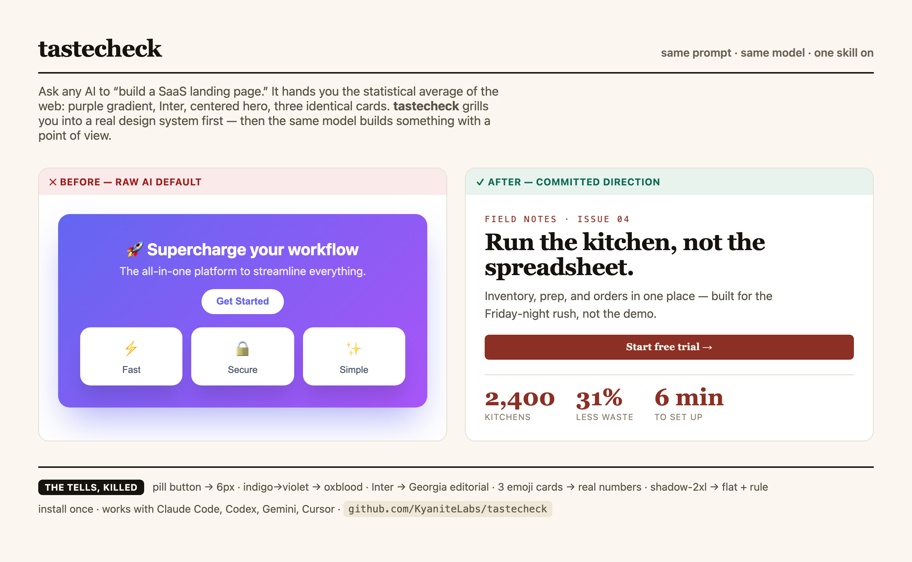

# TasteCheck



**Your AI-built UI stops looking AI-built.** TasteCheck is a set of skills for coding agents. A short design interview and a deslop pass fix the generic look. A ship gate then checks the result and says SHIP or HOLD, with evidence.

<!-- release-facts:v1:start -->
Release inventory: v1.7.0 · 20 skills · 20 canonical commands · 1 alias · 21 command files · 8 gallery systems.
<!-- release-facts:v1:end -->

[](LICENSE)
[](#the-20-skills)

## Quickstart

1. Install: `git clone https://github.com/KyaniteLabs/tastecheck && ./tastecheck/install.sh`
2. Open your coding agent in your project.
3. Run `/designsystem`. Answer a few questions; it writes `DESIGN-SYSTEM.md`.

Skills are plain Markdown, so any agent that can read files can use them. Slash commands are for Claude Code.

## The three commands to know

| Command | Use it when |
|---|---|
| `/designsystem` | You are starting. It interviews you and sets the design direction. |
| `/deslop` | You have UI that looks generic. It finds and removes the tells. |
| `/tastecheckpass` | You want to ship. It checks the real page and returns SHIP or HOLD. |

## The 20 skills

| Skill | What it does |
|---|---|
| [design-system-interview](skills/design-system-interview/SKILL.md) | Interviews you, then writes a design direction (type, color, density, tokens). |
| [tasteroll](skills/tasteroll/SKILL.md) | Rolls and locks a design direction when the brief is open. |
| [improve-existing-website](skills/improve-existing-website/SKILL.md) | Audits an existing site and keeps its identity while fixing it. |
| [color-system](skills/color-system/SKILL.md) | OKLCH palettes, semantic tokens, contrast. |
| [web-typography](skills/web-typography/SKILL.md) | Type systems, font loading, multilingual glyphs, hierarchy. |
| [spacing-system](skills/spacing-system/SKILL.md) | Rhythm, density, gaps, spacing scales. |
| [theming](skills/theming/SKILL.md) | Light, dark, forced-colors, saved preference, no flash. |
| [responsive-layout](skills/responsive-layout/SKILL.md) | Narrow containers, long content, zoom, reflow, overflow. |
| [component-states](skills/component-states/SKILL.md) | State matrices, keyboard behavior, ARIA. |
| [form-ux](skills/form-ux/SKILL.md) | Labels, autocomplete, validation, errors, mobile input. |
| [empty-states](skills/empty-states/SKILL.md) | Empty, loading, error, offline, first-run, layout stability. |
| [micro-motion](skills/micro-motion/SKILL.md) | Purposeful feedback, reduced motion, no hidden content. |
| [data-viz](skills/data-viz/SKILL.md) | Honest, accessible, themed charts and tables. |
| [art-direction](skills/art-direction/SKILL.md) | Imagery, icons, hero images, OG cards, generic AI imagery. |
| [a11y-pass](skills/a11y-pass/SKILL.md) | WCAG 2.2 AA: keyboard, screen readers, contrast, focus, target size. |
| [cognitive-a11y](skills/cognitive-a11y/SKILL.md) | Readability and predictability for ADHD, autism, dyslexia. |
| [i18n-ready](skills/i18n-ready/SKILL.md) | Locale expansion, RTL, logical properties, formats. |
| [deslop-ui](skills/deslop-ui/SKILL.md) | Removes AI-generated UI tells: purple gradients, pill CTAs, default type, card-grid sameness. |
| [humanize-copy](skills/humanize-copy/SKILL.md) | Removes LLM tells from landing, docs, UI and release copy. |
| [tastecheck-pass](skills/tastecheck-pass/SKILL.md) | The ship gate: SHIP or HOLD with evidence for each check. |

## How the gate works

`/tastecheckpass` loads the real rendered page and runs named checks: console errors, keyboard-only use, 320px and 400% zoom, tap targets, measured contrast, reduced motion, broken links and assets, leaked secrets, and template tells. It reports the verdict first, then one evidence line per check.

Three rules apply:

- A checkmark is not evidence. A check counts only if it ran and can cite what it saw (a selector, a URL, a number, a console line).
- It fails closed. A required check that fails, could not run, or has no evidence is HOLD.
- `n/a` means the subject is absent, never "not tested".

There is a fast lane (one agent, minutes) and a deep lane (a hashed one-row-per-check ledger run by a deterministic script, with independent review on subjective rows). Subjective rows remain accountable human or agent judgment, not an objective guarantee. Details are in [`docs/VERIFICATION.md`](docs/VERIFICATION.md).

## What we've measured, and what we haven't yet

<!-- release-status:v1:start -->
[](docs/VERIFICATION.md)
> **Release status:** PASS — current source-bound release receipts cover the asserted browser and accessibility checks.
> **Effectiveness status:** BLOCKED — historical evidence did not clear its release threshold.
<!-- release-status:v1:end -->

The gate has a labeled test corpus (`evals/corpus/`) and CI fails any change that makes its error counts worse. At v1.7.0, 17 cases: 12 true positives, 1 false negative, 4 true negatives, 0 false positives.

Read that number carefully. Only 2 of the 17 cases are visual-taste tells. The other 15 test gate integrity: forged or stale receipts, ledger tampering, leak detection. So this measures whether the gate can be fooled, not whether it has good design judgment. The one miss is a falsified but internally consistent observation, which cannot be caught offline.

"Effectiveness BLOCKED" means we have not yet shown, with a controlled comparison, that using TasteCheck produces better interfaces. An earlier attempt did not clear its threshold, and we do not claim a result until one does. Also not measured: agreement between different models or reviewers.

`npm test` checks repository contracts, install, links and verification plumbing. It is engineering evidence, not an effectiveness claim.

## Install

```bash
git clone https://github.com/KyaniteLabs/tastecheck && ./tastecheck/install.sh
```

Or from npm (the bare name `tastecheck` was rejected by the registry as too close to `fast-check`):

```bash
npm install @puenteworks/tastecheck
npx tastecheck --help
```

The installer links skills into `~/.agents/skills/` and into any agent skill directories it detects. For Claude Code it can also link the 21 command files (20 commands plus the `/darkmode` alias for `/theming`) into `~/.claude/commands/`. `install.sh` needs a POSIX shell. On Windows, use `npx @puenteworks/tastecheck install`, which runs the same installer in Node.

Also: the gate has checks for video artifacts (reading time, authored motion, readability, audio presence).

## Gallery

Eight browser-rendered design systems for the same product story. They show how far directions can differ; derive your own rather than copying one.

| System | Territory | Signature structure |
|---|---|---|
| [Copper](samples/copper/) | dark, warm, geological | irregular tessellated bento with structural basalt columns |
| [Swiss](samples/swiss/) | light, austere, exact | exposed column grid carrying the content |
| [Maximal](samples/maximal/) | loud, kinetic | display word bleeding into a magenta block with sticker-wall collage |
| [Concrete](samples/concrete/) | raw, mechanical, monochrome | ruled spec sheet with a dense ledger table and hazard accent |
| [Clay](samples/clay/) | warm, soft, humanist | alternating zig-zag card flow with organic pebble shapes |
| [Dispatch](samples/dispatch/) | dark, operational, emerald | reverse-chronological release timeline |
| [Verge](samples/verge/) | cool, clinical, measured | hypothesis-to-verdict evidence cards |
| [Seed](samples/tasteroll/) | warm, procedural, annotated | seeded specimen card with rolled dimensions |

Live: [landing page](https://kyanitelabs.github.io/tastecheck/), [gallery](https://kyanitelabs.github.io/tastecheck/samples/).

## FAQ

**How is this different from a design prompt?** It makes design decisions explicit before the agent builds, then checks the built page against them.

**Does it replace a designer?** No. Subjective checks stay human judgment.

**Is it free?** Yes, MIT.

## License

MIT. See [`LICENSE`](LICENSE). Contributions: [`CONTRIBUTING.md`](CONTRIBUTING.md). Security reports: [`SECURITY.md`](SECURITY.md).

GitHub ([KyaniteLabs/tastecheck](https://github.com/KyaniteLabs/tastecheck)) is the home for code, [issues](https://github.com/KyaniteLabs/tastecheck/issues) and pull requests.
